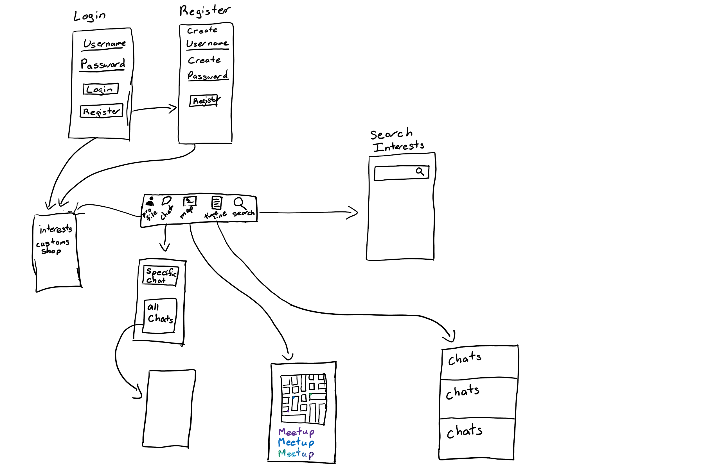
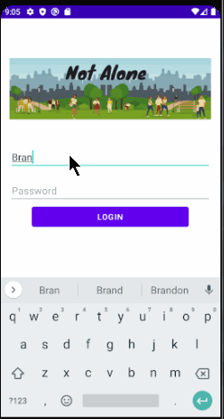
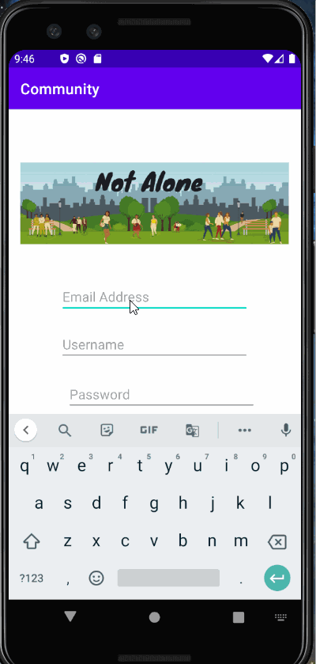

# Community-App
App created by: Lucas Goldman, Neil Kuldip, Ambonique Thomas

Original App Design Project - README Template
===

# Community App

## Table of Contents
1. [Overview](#Overview)
1. [Product Spec](#Product-Spec)
1. [Wireframes](#Wireframes)
2. [Schema](#Schema)

## Overview
### Description
A location based community app where users can chat or meetup with other users in their area

### App Evaluation
[Evaluation of your app across the following attributes]
- **Category:** Social, Lifestyle
- **Mobile:** This app would be developed primarily for Android devices.
- **Story:** The app functions as a social medium for nearby people in a local community to be matched by common interests to communicate and become friends. Users can choose their top three interests and the radius of proximity for matching. However, the catch is that the AI decides who that person is paired to but the user decides whether to continue the conversation.
- **Market:** For ages 18+.
- **Habit:** The app can be used daily at any time of the day. There will be notifications for the user if there are responses from the chats.
- **Scope:** First we have our users create accounts and that will direct them to choose their top three interests. Afterwards, they will choose the proximity in miles from their location. From there, whether they choose to close the app or not, they will get a notification when they are matched to another user. This will take them to a chat with the other user to communicate.

## Product Spec

### 1. User Stories (Required and Optional)

**Required Must-have Stories**

- [x] User can login
- [x] User can register an account
- [ ] User can make a profile
- [ ] Chats - matched by interests
- [ ] An interests tab
    - [ ] 3 column boxes w/ popular interests & search bar to find specific interests
    - [ ] name of interest + photo from google images of that interest? - should be found automatically
* ...

**Optional Nice-to-have Stories**

* A timeline of all chats
* A search feature to look for chats
* A map to view meetups
* Gamify app usage with coins (profile section) to increase usage in the app
* ...

### 2. Screen Archetypes

* Login
   * Register 
       * For first time users this should take them to interests page
       * Let them select stuff theyre interested in - make a profile
   * Profile
       * Finding users screen - feel free to close the app - or select more interests
       * Give a notification when a chat has been opened between 2 users
* Chats
   * Should be able give notifications of a new chat 
   * All chats -> clicking on a specific chat leads to different screen
   * Specific chat
       * Close chat
       * Send messages
       * No sending photos
* [stretch stories]
    * map
    * timeline
    * search

### 3. Navigation

**Tab Navigation** (Tab to Screen)

* We dont need to worry about navigation until stretch stories
    * Fragments
        * Map
        * Profile
        * Timeline
        * Chats

**Flow Navigation** (Screen to Screen)

* First login (register)
   * Interests
   * Profile
   * Close the app / Select more interests
* Opening after logging in for the first time
   * Chats
   * Timeline [stretch goal] - fragments for stretch goals

## Wireframes



Here's a walkthrough of implemented user stories:





### [BONUS] Digital Wireframes & Mockups

### [BONUS] Interactive Prototype

## Schema 
### Models

#### User

|   Property    | Type    | Description            |
| ------------- | ------- | ---------------------- |
| objectId      | String  | unique id for the user account (default field) |
| emailVerified | Boolean | determines if the email address exists |
| username      | String  | username the user chose for the account |
| createdAt     | DateTime | date when user account was created (default field) | 
| password      | String  | password the user chose for their account |
| email         | String | email address the user supplied when creating the account |
| interestList  | Array  | array stores interests pointers chosen by user |
| location | GeoPoint | stores the user's current location |

#### Interests

| Property | Type     | Description |
| -------- | -------- | --------    |
| objectId | String   | unique id for the interest label (default field) |
| createdAt | Date    | date when label was created and added to list of labels (default field) |
| usersInterested | Array | array that stores pointers to user accounts when users choose the interest for their profiles |
| screenName | String | interest name (*this should follow standard capitalization for the interest*) |
| name | String | interest name (*should always be lowercase*) |

#### Chat

| Property | Type     | Description |
| -------- | -------- | --------    |
| objectId | String   | unique id for the conversation formed with two unique users (default field) |
| createdAt | Date | date when the coversation was first generated (default field) |
| messageList | Array | array of messages between 2 users - **ordered by oldest first** |
| users      | Array | array that stores pointers to user accounts involved in this chat |

#### Message

| Property | Type | Description |
| -------- | -------- | -------- |
| objectId | String   | unique id for the text bubble created by user's text message (default field) |
| createdAt | Date | date when the message was sent (default field) |
| user | Pointer | user who created the message | 
| textMessage | String | message that the user sent |

### Networking
   - Login Screen
      - (Create/GET) Create an account
      ```android
      public void createUser() {
      ParseUser user = new ParseUser();
      user.setUsername("my name");
      user.setPassword("my pass");
      user.setEmail("email@example.com");
      ```     
   - Chat Screen
      - (Read/GET) Query all chats where user is author
      ```android
      // The query will search for a ParseObject, given its objectId.
     // When the query finishes running, it will invoke the GetCallback
     // with either the object, or the exception thrown
     query.getInBackground("<PARSE_OBJECT_ID>", (object, e) -> {
           if (e == null) {
           //Object was successfully retrieved
         } else {
           // something went wrong
           Toast.makeText(this, e.getMessage(), Toast.LENGTH_SHORT).show();
         }  
     });
      ```
      - (Delete) Delete existing chat
      ```android
         // Retrieve the object by id
     query.getInBackground("<PARSE_OBJECT_ID>", (object, e) -> {
       if (e == null) {
         //Object was fetched
         //Deletes the fetched ParseObject from the database
         object.deleteInBackground(e2 -> {
             if(e2==null){
                 Toast.makeText(this, "Delete Successful", Toast.LENGTH_SHORT).show();
             }else{
                 //Something went wrong while deleting the Object
                 Toast.makeText(this, "Error: "+e2.getMessage(), Toast.LENGTH_SHORT).show();
             }
         });
       }else{
         //Something went wrong
         Toast.makeText(this, e.getMessage(), Toast.LENGTH_SHORT).show();
       }
     });
      ```
      - (Create/POST) Create a new chat object
      ```android
      ParseObject entity = new ParseObject("Chat");

     entity.put("messagesList", new JSONArray());
     entity.put("users", new JSONArray());

     // Saves the new object.
     // Notice that the SaveCallback is totally optional!
     entity.saveInBackground(e -> {
       if (e==null){
         //Save was done
       }else{
         //Something went wrong
         Toast.makeText(this, e.getMessage(), Toast.LENGTH_SHORT).show();
       }
      ```
   - Profile Screen
      - (Update/PUT) Update user interests
         ``` 
         public void changeInterest(ParseUser user, Interest oldInterest, Interest newInterest) {
           if (user != null) {
            user.removeInterest(oldInterest);
            user.addInterest(newInterest);

             // Saves the object.
             user.saveInBackground(e -> {
               if(e==null){
                 //Save successfull
                 Toast.makeText(this, "User interests updated", Toast.LENGTH_SHORT).show();
               }else{
                 // Something went wrong while saving
                 Toast.makeText(this, e.getMessage(), Toast.LENGTH_SHORT).show();
               }
             });
           }
         }
         ```
      - (Update/PUT) Update user profile image
          ``` 
         public void updateProfileImage(ParseUser user, ImageFile image) {
              if (user != null) {
               user.setProfileImage(image);

             // Saves the object.
             user.saveInBackground(e -> {
               if(e==null){
                 //Save successfull
                 Toast.makeText(this, "Profile image updated", Toast.LENGTH_SHORT).show();
               }else{
                 // Something went wrong while saving
                 Toast.makeText(this, e.getMessage(), Toast.LENGTH_SHORT).show();
               }
             });
           }
         }
         ```
- [OPTIONAL: List endpoints if using existing API such as Yelp]
